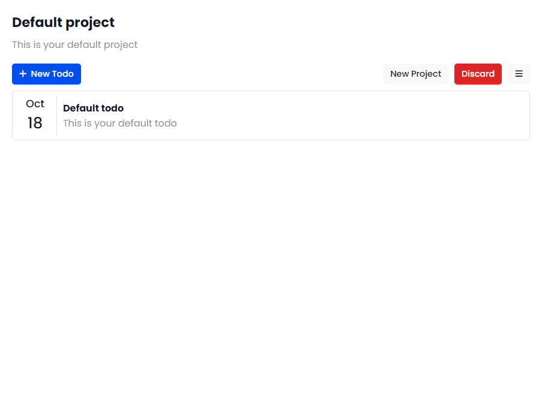
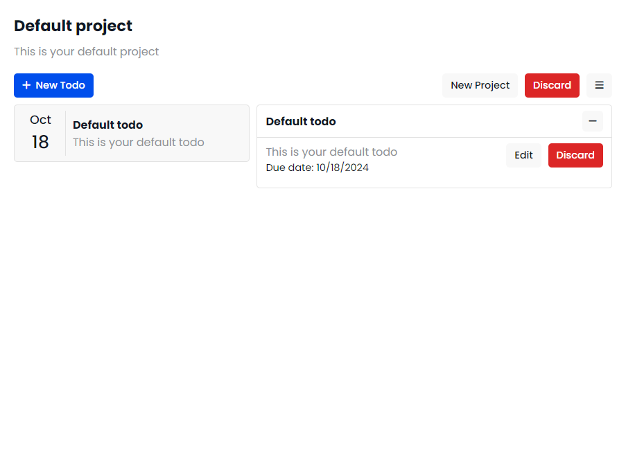
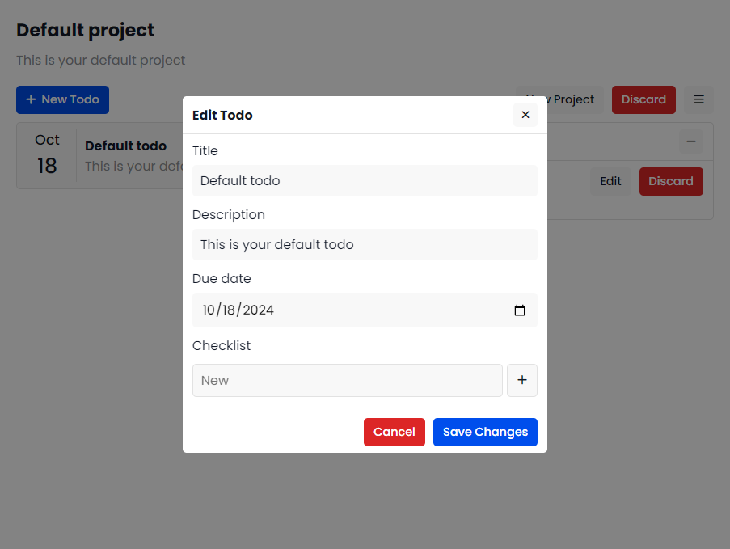
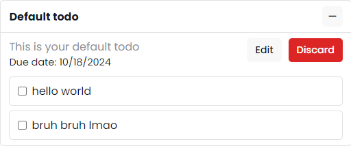
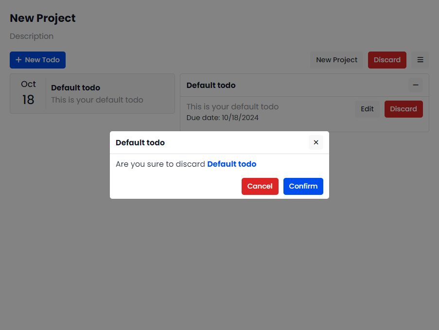
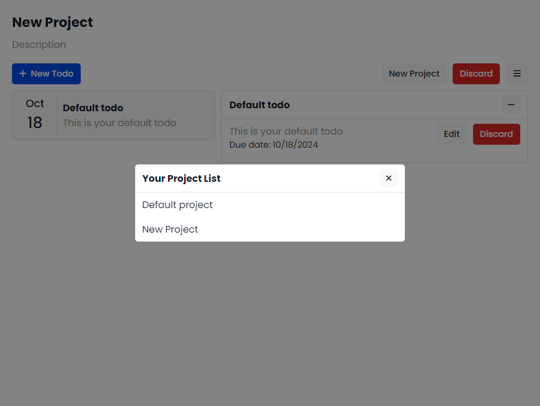

# Odin Todo List

- This project represents a web-based todo list app.

### Preview Screenshots:

- Default page: This will appear when you first visit the app

- Todo item detail:

- Edit Todo Modal: This modal allows user to edit todo item information

- Checklist: This one is included inside todo items

- Discard Modal:

- Project List:

### Requirements:

- This app contains projects (the user has 1 project by default).
- Each project contains todo items.
- When the user clicks one of the items, a detailed section shows up to the right of the todo list and shows them the content of the todo item including a title, a description, a duedate and a checklist (optional).
- The user can discard items, set items as complete, change priority, edit information of todo items.
- The user can create new todo items and new projects.
